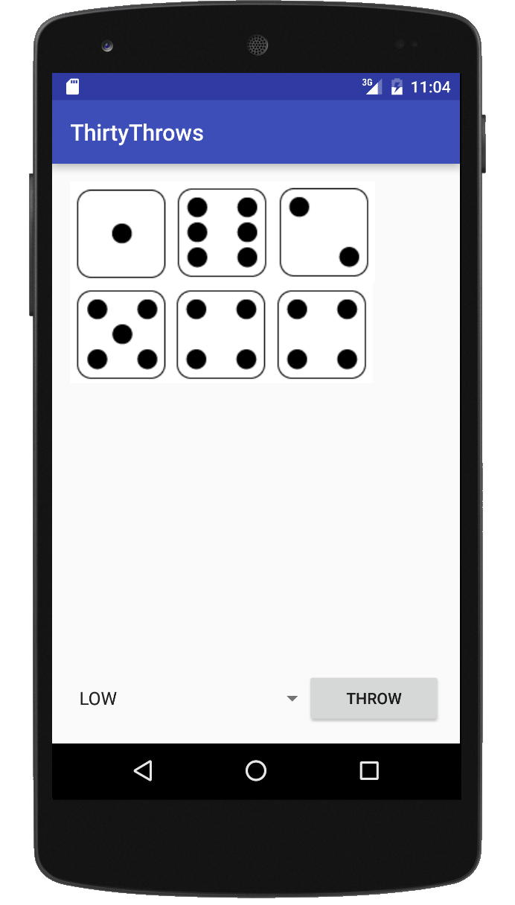

# Information

I denna obligatoriska uppgift så ska ni göra en Android-applikation för att bekanta er med utvecklingsmiljön Android Studio och Androids API:er. Den applikation ni ska utveckla är en implementation av tärningsspelet Thirty för en spelare (ni får göra för flera också, men se till att det funkar för en först).

## Beskrivning av spelet Thirty

Thirty är ett tärningsspel inte helt olikt Yatzy där man slår sex tärningar i omgångar. I varje omgång  får sedan slå om de man vill av tärningarna två gånger. Vid varje omslag får spelaren välja vilka av de sex tärningar den vill slå om respektive behålla. Efter de tre slagen beräknar man poängen för tärningarna. Ett spel består sedan av 10 stycken sådana omgångar. Vi kommer alltså totalt göra maximalt 30 slag, därav namnet på spelet.

### Poängsättning

Vid poängsättningen så väljer man vad som ska räknas i denna omgång. För möjliga val se tabellen nedan. Varje val får göras maximalt en gång under ett spel. Vid poängräkningen får värdet av varje tärning räknas bara en gång. Då spelet är slut ska spelarens totala poäng visas samt hur många poäng denne fick för varje möjligt val (alla val kommer användas en gång).

| Val  | Vad som räknas (Summan av alla för valet ingående tärningars värde ger poängen) |
|------|-------------------------------------------------------------------------------|
| Low  | Alla tärningar med värde 3 eller lägre ger poäng                              |
| 4    | Alla kombinationer av en eller flera tärningar som ger summan 4               |
| 5    | Alla kombinationer av en eller flera tärningar som ger summan 5               |
| 6    | Alla kombinationer av en eller flera tärningar som ger summan 6               |
| 7    | Alla kombinationer av en eller flera tärningar som ger summan 7               |
| 8    | Alla kombinationer av en eller flera tärningar som ger summan 8               |
| 9    | Alla kombinationer av en eller flera tärningar som ger summan 9               |
| 10   | Alla kombinationer av en eller flera tärningar som ger summan 10              |
| 11   | Alla kombinationer av en eller flera tärningar som ger summan 11              |
| 12   | Alla kombinationer av en eller flera tärningar som ger summan 12              |

Exempel: En spelare har efter sina 3 slag fått tärningarna 1, 1, 1, 2, 4 och 4 och väljer att poängsätta detta som 5. Han bör då få 10 poäng då han kan få ihop grupper av tärningar bestående av en etta och fyra. Slår man 1,2,3,4,5,6 och räknar detta som low så ska man få 6 poäng (summan av 1,2,3). För poängräkningen så så kan ni antingen låta användaren gruppera ihop tärningarna i enighet med det valda poängräkningsalternativet (**OBS detta är absolut enklast och att föredra, att försöka göra grupperingen automatisk är nog den största orsaken till att misslyckas med uppgiften**), eller så får ni ha en automatisk hopparning av tärningar (dvs att datorn sköter om att beräkna poängen utifrån användarens val av poängräkningsalternativ). Användaren ska i båda fallen få välja vilket av poängräkningsvalen som ska användas. OBS! Gör ni helautomatisk poängräkning så tänk på att det inte bara är att där kombinera ihop tärningar hur som helst. Hade vi tex istället parat ihop de tre ettorna med tvåan så hade vi också kommit upp till 5, men hade sedan inte kunnat använda de andra tärningarna till något varvid slutresultatet hade blivit lägre än det spelaren förväntade sig. Vid manuell hopparning ska programmet kontrollera så att användarna ej gör något som inte är tillåtet.

## Gränssnitt och övriga krav på er app

Ni får utforma gränssnittet i er app som ni vill. Tänk dock på att göra det så användarvänligt som möjligt. Testa gärna på en riktig mobil om ni har möjlighet så att ni ser att det fungerar i praktiken också, samt på olika skärmstorlekar i emulatorn. En annan sak som bör testas är att tillstånd sparas korrekt så att appen inte startas om (eller något annat oväntat inträffar) vid rotation av telefonen eller då aktiviteten behöver startas om då den varit i bakgrunden. Appen ska bestå av minst två olika skärmvyer (Activities/Fragments): en som hanterar själva spelvyn och en för att visa resultatet vid spelets slut. Delresultat per val (obs vilket val som gjorts för respektive poäng ska framgå tydligt) och en totalsumma ska visas i resultatvyn. Spelet ska gå att spela flera gånger utan att appen behöver stängas ner.

​  
Figur 1: Exempel på hur en spelvy kan se ut.

## Inlämning och Regler

Uppgiften ska lösas enskilt. En ZIP-fil med det färdiga projektet (skapat i Android Studio) inklusive väl kommenterad källkod ska lämnas in via Canvas (kör gärna clean på projektet innan inlämning så blir filen rätt mycket mindre). Er kod ska följa god objektorienterad programmeringsmetodik och vara skriven i Kotlin. Tänk till exempel på att separera modellkod (spellogiken) från controller-klasser som till exempel Activities. Tänk också på att dela upp era program i klasser med lagom stort ansvar. Lösningar där hela programmet är gjort i en enda Activity/Fragment-klass kommer till exempel inte godkännas.

## Bildfiler som ni kan använda om ni vill

Om ni vill så kan ni använda er av följande bilder på tärningar i ert program: [dice.zip](dice.zip) Nya vektorbaserade varianter på tärningar: [dice_vector.zip](dice_vector.zip)

## Diskussion/Frågor kring uppgiften

Tas i första hand via diskussionsforumet för uppgiften: Frågor rörande inlämningsuppgift 1
